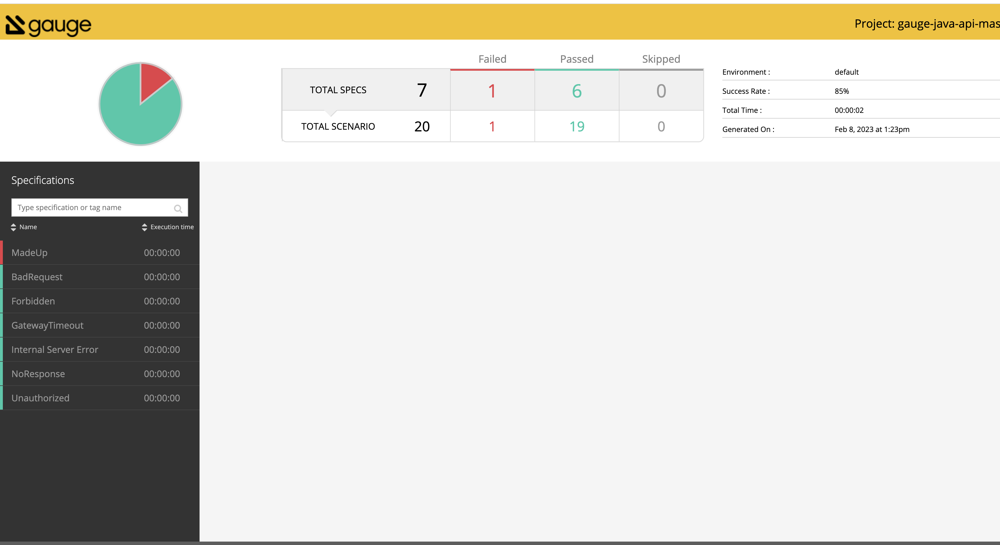

# Submission Instructions

As part of your submission, we'd like you to create a new `private` git project and give us access to the project.

## Create a new project on Github

1. Create an account with `GitHub.com` (if you don't have one already).
2. Create a new `private` project on Github with your name as the project name. e.g. `adam-smith`

Further instructions can be found here <https://help.github.com/en/articles/create-a-repo>

## Commit files to project

1. Open `cmd/terminal`.
2. Change to project directory.
3. Run `git init` to initialize as git repository.
4. Add all files with `git add .`
5. Commit your changes `git commit -m "Adding submission files"`
6. Add your new project remote `git remote add origin your-project-url`
7. Push changes `git push -u origin master`

## Add a Collaborator

1. Click on `Settings` on your Github project
2. Click on `Collaboration & teams` option from left menu
3. Under the collaborators, Search and add `biniosuaf`, `karl-lock` and `haroon-sheikh` as collaborators with `Admin` access.

## Issues

If you're facing any issues with the above, please just archive (zip) the project directory and reply back to the recruitment team with it attached.

##  Test Results
Please find test issues about API document and Postman collections under TestReuslts file. Also you can find below some general problems about Api Standarts

### General Problems in the API Document

1. There is not a standard response object for POST methods. Post responses are changed from endpoints to endpoints. In some responses, the error object is not returned. In some responses, error objects start with the route names. Error response should return a standard error object for all POST methods, such as the following:

```json

{
  "errors": [
    {
      "timestamp": "2023-02-05T22:24:55Z",
      "type": "FAILURE",
      "code": "gateway_timeout",
      "message": "Gateway Timeout",
      "path": "/v1/api/gateway_timeout"
    },
    {
      "receivedRequest": [
        {
          "customerId": "69985cb3-cc44-4e9c-a74f-4b2f1891f6be",
          "customerName": "Hertha",
          "lastName": "Wehner",
          "occupation": "Dynamic Interactions Facilitator",
          "phoneNumber": "1185261665"
        }
      ]
    }
  ]
}
```


3. In the request and response headers, there is no Content-Type/mediaTypeUsed. Content-Type/mediaTypeUsed should be used in the request and response headers. MediaTypeUsed/Content-Type is usually placed in the header section of an HTTP message, not the body.

4. There are no API version numbers in the endpoints.

5. In the latest routes, "mediaTypeUsed": "application/vnd.json" is returned in the responses. MediaTypeUsed or Content-Type is usually placed in the header. Also, API version numbers can be used in the Content-Type. For example, application/vnd.v1+json. vnd.v1 is a vendor-specific media type, indicating that it is a custom media type defined by the vendor or owner of the API and v1 is the version of the API.

6. There are two duplicate unauthorised routes in the document.

7. In some response data, “receivedRequest” is used as the key name for the requested payload data, in some responses “bodyReceived” is used. There should be a standard one key name.

8. GET methods don't return a json response object. Error responses should return a standard response object, such as the following:

```json
{
  "errors": [
    {
      "timestamp": "2023-02-05T15:49:31Z",
      "type": "FAILURE",
      "code": "internal_server_error",
      "message": "Internal Server Error",
      "path": "/v1/api/internal_server_error"
    }
  ]
}

```
### Test report
You can find the test report in reports/html-report



